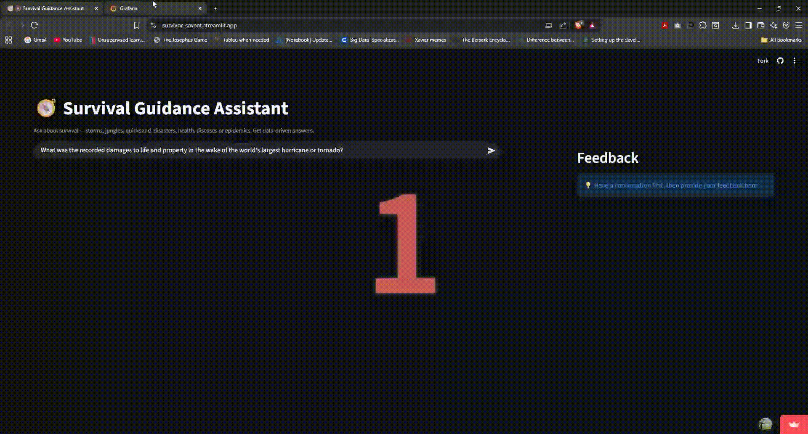

# 🧭 Survival Guidance Assistant  
*A Retrieval-Augmented Generation System for Evidence-Based Survival Advice*

 

## 🟠 Problem Description : Unlocking Structured Knowledge from Unstructured Media

### The Information Accessibility Problem
In today's digital landscape, valuable expert knowledge remains trapped in unstructured formats—particularly in video and audio content. While platforms like YouTube host incredible domain expertise, this knowledge is:

- 🔒 **Temporally locked** in hour-long videos  
- 🔗 **Structurally fragmented** across multiple content pieces  
- 🔍 **Difficult to search** beyond basic metadata  
- 🔄 **Lacking cross-references** between related concepts

---

## 🚀 The Solution: A Survival Knowledge Intelligence Platform
This project demonstrates how to transform unstructured survival content into an **intelligent, queryable knowledge base** using the *"How to Survive"* YouTube channel as a domain case study.

### The Transformation Pipeline
I've engineered an end-to-end system that revolutionizes how we interact with media content:

| Traditional Media | ➡️ | Our Intelligent System |
|---:|:---:|:---|
| 📺 Passive video consumption | → | 🔍 Active knowledge retrieval |
| 🎯 Manual content searching | → | 🤖 Semantic understanding of queries |
| 📝 Note-taking & bookmarking | → | 💾 Automated knowledge extraction |
| ❓ Isolated information | → | 🔗 Cross-referenced insights |

---

## ⚡ Real-World Impact
For survival scenarios where seconds count, our system delivers:

- ⚡ **Rapid access** to precise survival procedures  
- 📚 **Evidence-backed guidance** sourced from trusted content  
- 🎯 **Context-aware responses** tailored to specific emergencies  
- 🔄 **Continuous improvement** through user feedback loops

---

## 🌟 Beyond Survival: A Blueprint for Domain Intelligence
Although implemented for survival knowledge, this architecture is a reusable template for building intelligent knowledge bases in any domain:

- 🏥 Medical education from expert lectures  
- 💻 Technical training from tutorial content  
- 🏢 Corporate knowledge from internal presentations  
- 🎓 Academic research from conference recordings

---

> 💡 **This isn't just another RAG system** — it's a production-grade framework for transforming any media repository into an interactive knowledge companion. Features include ingestion, RAG retrieval, LLM reasoning, monitoring, user feedback, and cloud-native deployment.  
>
> **The result:** a transparent, reliable assistant that makes expert knowledge instantly accessible — backed by the original sources that generated it.

---

## 🟢 Solution Overview  

**Survival Guidance Assistant** is a modular end-to-end RAG pipeline that transforms raw video transcripts into a **searchable, explainable and survival knowledge base**.  

Users can query the system via a [**Streamlit interface**](https://survivor-savant.streamlit.app/), get **evidence-backed answers** structured by OpenAI but strictly based on a knowledge base of transripts from playlist of the popular YouTube channel *How to survive*, and submit usage feedback through the interface.

> 💡 Built as a capstone project for the DataTalks.Club LLM Zoomcamp, this project demonstrates full-stack RAG application development engineered with MLOps practices — ingestion, RAG retrieval, LLM reasoning, monitoring, and containerization with Docker & Docker Compose — culminating in a multi-cloud deployment where diverse services orchestrate seamlessly to deliver a consolidated, intelligent, and production-ready retrieval experience.

---

 ## 📚 Data 
 
  Currently data readily available for each stage in the project repository for only [2 playlists](/playlists.properties) from the channel [*How to Survive*](https://www.youtube.com/@HowToSurviveShow/playlists) and upserted to knowledge base on [Qdrant Cloud](images/Qdrant-colour.gif). One is [*Natural Disasters*](https://www.youtube.com/playlist?list=PLSG9IRx05GOlqnHGUm2bYVi2KPXYC_lTg) and the other is [*Health*](https://www.youtube.com/playlist?list=PLSG9IRx05GOn-ioDWMw5-92PsbPi-MHSH)

  > However, it is pertinent to mention that before using the data, permission might have to be taken from the content creator. For educational purposes such as this and the hugely transformative nature of process dealing with the data/content, a fair use allowance could be inferred.

---

## 🔧 Tech Stack  

 | **Layer** | **Technology**  |
 |:-----------|:---------------|
 | Transcript extraction & audio track download | YouTube DATA API, YouTubeTranscriptApi, yt_dlp
 | Automatic Speech Recognition|  Faster Whisper |
 | Embedding Genration | FastEmbed |
 | Vector DB | Qdrant Cloud |
 | LLM  |  OpenAI API |
 | Webservice API Framework | FastAPI |
 | User Interface | Streamlit |
 | Feedback Storage | AWS RDS (PostgreSQL) |
 | Monitoring | Grafana Cloud |
 | Containerization | Docker & Docker Compose |

---


## ⚙️ Solution Summary  

 | **Stage** | **Description** |
 |:-----------|:----------------|
 | **Content Catalog Generation** | Generate [content catalog](ingestion/content_catalog.py) from the metadata of videos from playlists in input [properties file](playlists.properties) with *YouTube Data API* |
 | **Identify New Videos** | Compares the previous content catalog and the newly generated one to identify new videos to extract transcripts from or download audio tracks with *yt_dlp* for those without any transcript options|
 | **Transcript Ingestion** |  [Extract transcripts](ingestion/transcript_ingestion.py) from the identified videos with *YouTubeTranscriptApi* |
 | **ASR**  | Video without transcripts and those failing transcript extraction are lined up for [ASR](ingestion/asr_operation.py) and processed throught **Faster Whisper** |
 | **Chunking, Embedding & Storage** | [ Chunk transcripts](ingestion/transcript_chunking.py) into semantically meaningful segments with metadata (title, chapter, timestamp).& convert them to vector embeddings with **FastEmbed** and [store them](ingestion/chunk_embedding_upserting.py) in **Qdrant Cloud** for semantic retrieval. |
 | **Orchestration** | **Prefect** as the [orchestrator](images/final-orchestrated-ingestion-pipeline-1.png) for [deploying cron-scheduled workflows](images/Prefect-perfect-deployments.png) of the [Ingestion](orchestration/orchestrated_content_ingestion.py) and the [Chunk-Embed-Upsert](orchestration/orchestrated_chunking_embedding_upsert.py) pipelines. |
 | **Retrieval** | [**FastAPI** service](rag/rag_service_serve.py) now [retrieves](rag/retrieval.py) top-matching chunks and sorts them in descending order of their cosine similarity |
 | **Augmented Generation** | These chunks are then used as context in the prompt-templates for dynamic generation of prompts to be [sent to the LLM](rag/llm_augment.py) with **OpenAI API**  |
 | **User Interface** | **Streamlit** [app](interface_app/app.py) for the user interface complete with User Feedback mechanism for [monitoring](interface_app/monitoring.py) |
 | **Feedback Loop** | User feedback (sentiment, clarity, satisfaction) logged to **PostgreSQL** and visualized via [**Grafana Cloud**](https://sapientsapien4ai.grafana.net/public-dashboards/0da5412b934d42fba542bdd5d67e2ab7). |
 | **Deployment** | Two lightweight containers — [`rag_api`](rag/Dockerfile) (FastAPI) and [`streamlit_app`](interface_app/Dockerfile) (UI) — orchestrated via [**Docker Compose**](docker-compose.yml) |


---

## 🧩🧱 Architecture Overview  

```text
┌─────────────────────────────────────────────────────────────────────────────────────────────────┐
│                            SURVIVAL GUIDANCE ASSISTANCE SYSTEM                                  │
└─────────────────────────────────────────────────────────────────────────────────────────────────┘

                                      
                                      ┌──────────────────────────────────┐
                                      │   INPUT SOURCE : properties file │
                                      │       YouTube Playlist URLs      │
                                      └─────────┬────────────────────────
                                                │
                                                ▼
┌─────────────────────────────────────────────────────────────────────────────────────────────────┐
│                  PREFECT ORCHESTRATED INGESTION PIPELINE - PART 1                               │
└─────────────────────────────────────────────────────────────────────────────────────────────────┘

                        ┌─────────────────────────────────────────────────┐
                        │            Content Catalog Creator              │
                        │  - Processes YouTube playlist URLs              │
                        │  - Creates video metadata catalog               │
                        │  - Identifies videos with/without transcripts   │
                        └───────────────┬─────────────────────────────────┘
                                        │
                                        ▼
                        ┌─────────────────────────────────────────────────┐
                        │           Transcript Downloader                 │
                        │  - Downloads available transcripts (JSON)       │
                        │  - Filters successful/failed downloads          │
                        └───────────────┬─────────────────────────────────┘
                                        │
                                        ▼
                        ┌───────────────┴───────────┐
                        │          SPLIT PATH       │
                        └───────────────┬───────────┘
                                        │
                ┌───────────────────────┼───────────────────────┐
                │                       │                       │
                ▼                       ▼                       ▼
┌─────────────────────────┐  ┌─────────────────────────┐  ┌─────────────────────────┐
│  Successful Transcripts │  │  Failed Transcripts     │  │   No Transcripts        │
│       (JSON files)      │  │    (Video List)         │  │     (Video List)        │
└─────────────────────────┘  └─────────────────────────┘  └─────────────────────────┘
                │                       │                       │
                └───────────────────────┼───────────────────────┘
                                        │
                                        ▼
                        ┌─────────────────────────────────────────────────┐
                        │           Audio Processing Pipeline             │
                        │  - Downloads audio clips for failed videos      │
                        │  - ASR Transcription using Faster Whisper       │
                        │  - Output: JSON transcripts                     │
                        └───────────────┬─────────────────────────────────┘
                                        │
                                        ▼
                        ┌─────────────────────────────────────────────────┐
                        │          All Transcripts (JSON)                 │
                        │  - Original + ASR generated transcripts         │
                        └───────────────┬─────────────────────────────────┘
                                        │
                                        ▼
┌─────────────────────────────────────────────────────────────────────────────────────────────────┐
│                      PREFECT ORCHESTRATED INGESTION PIPELINE - PART 2                           │
└─────────────────────────────────────────────────────────────────────────────────────────────────┘

                        ┌─────────────────────────────────────────────────┐
                        │           Chapter-based Chunker                 │
                        │  - Segments transcripts by video chapters       │
                        │  - Creates semantic chunks                      │
                        └───────────────┬─────────────────────────────────┘
                                        │
                                        ▼
                        ┌────────────────────────────────────────────────────────────────┐
                        │             Embedding Generator                                │
                        │  - Model: "BAAI/bge-base-en-v1.5"                              │
                        │  - Converts chunks to vector embeddings with FastEmbed         │
                        └───────────────┬────────────────────────────────────────────────┘
                                        │
                                        ▼
                        ┌─────────────────────────────────────────────────┐
                        │              Vector Store Client                │
                        │  - Upserts embeddings to Qdrant Cloud           │
                        │  - Manages vector collections                   │
                        └───────────────┬─────────────────────────────────┘
                                        │
                                        ▼
                        ┌─────────────────────────────────────────────────┐
                        │        QDRANT CLOUD <---> RAG Pipeline          │
                        │  - Vector similarity search                     │
                        │  - Metadata storage                             │
                        │  - Collection management                        │
                        └─────────────────────────────────────────────────┘

                                        │
                                        ▼
┌─────────────────────────────────────────────────────────────────────────────────────────────────┐
│                        RAG PIPELINE (FASTAPI SERVICE)                                           │
└─────────────────────────────────────────────────────────────────────────────────────────────────┘

                        ┌─────────────────────────────────────────────────┐
                        │            FastAPI Application                  │
                        │  - REST API endpoints                           │
                        │  - User Query embedding                         │
                        │  - Vector search execution                      |
                        |  - Serves User a strucutured answer from LLM    │
                        └───────────────┬─────────────────────────────────┘
                                        │
                        ┌───────────────┴─────────────────────────────────┐
                        │          COMPONENTS                             │
                        └───────────────┬─────────────────────────────────┘
                                        │
                ┌───────────────────────┼───────────────────────┐
                ▼                       ▼                       ▼
┌─────────────────────────┐  ┌─────────────────────────┐  ┌─────────────────────────┐
│     Query Processor     │  │    Vector Retriever     │  │    Response Generator   │
│- User query vector embed│  │  - Cosine similarity    │  │  - OpenAI integration   │
│- Conditional Query      |  |  - Top-k retrieval      |  |  - Prompt engineering   |  
|  re-writing with LLM    │  │                         │  |                         │     
└─────────────────────────┘  └─────────────────────────┘  └─────────────────────────┘
                │                       │                       │
                └───────────────────────┼───────────────────────┘
                                        │
                                        ▼
                        ┌─────────────────────────────────────────────────┐
                        │                  OPENAI API                     │
                        │  - LLM for response generation                  |
                        |  - LLM for Qyery Re-writing                     │
                        │  - Context-aware answers                        │
                        └─────────────────────────────────────────────────┘

                                        │
                                        ▼
┌─────────────────────────────────────────────────────────────────────────────────────────────────┐
│                           STREAMLIT CHATBOT INTERFACE                                           │
└─────────────────────────────────────────────────────────────────────────────────────────────────┘

                        ┌─────────────────────────────────────────────────┐
                        │            Streamlit Application                │
                        │  - User interface                               │
                        │  - User Query Response                          │
                        │  -Chat history management /Query rewrite        |
                        |  - User experience feedback collection          │
                        └───────────────┬─────────────────────────────────┘
                                        │
                        ┌───────────────┴─────────────────────────────────┐
                        │                   COMPONENTS                    │
                        └───────────────┬─────────────────────────────────┘
                                        │
                ┌───────────────────────┼───────────────────────┐
                ▼                       ▼                       ▼
┌─────────────────────────┐  ┌─────────────────────────┐  ┌─────────────────────────┐
│     UI Controller       │  │    API Client           │  │    Feedback Collector   │
│  - Chat interface       │  │  - FastAPI calls        │  │  - User rating system   │
│  - Session management   │  │  - Error handling       │  │  - Feedback storage     │
└─────────────────────────┘  └─────────────────────────┘  └─────────────┬───────────┘
                                                                        │
                                                                        ▼
                                                        ┌─────────────────────────────────┐
                                                        │   FEEDBACK DATABASE             │
                                                        │   AWS RDS PostgreSQL            │
                                                        │  - Upvote (+) Downvote (-)      | 
                                                        |  - Qunatitative User            |        
                                                        |    Satisfaction Level           │
                                                        │  - Categorised Usage            |
                                                        |    Sentiment on Response Quality│
                                                        └─────────────┬───────────────────┘
                                                                      │
                                                                      ▼
┌─────────────────────────────────────────────────────────────────────────────────────────────────┐
│                              MONITORING & ANALYTICS                                             │
└─────────────────────────────────────────────────────────────────────────────────────────────────┘

                        ┌──────────────────────────────┐
                        │            Grafana Cloud     |
                        │  - Performance dashboards    │
                        │  - User feedback analytics   │
                        │  - System metrics            │
                        └─────────────── ──────────────┘
                                        ▲
                                        │             
                                        |
                                        |                      
                          ┌────────────────────────────┐
                          │     AWS RDS PostgreSQL     │
                          │    (Feedback Data)         |
                          └────────────────────────────┘

```

## ♻️⟶ 🔁 ⟶ Reporoducibility

   #### 🏭Kindly set up the environment and configuration of the VM or your local machine (with WSL). Sequentially proceeed : ####

   - Install docker

            update apt before doing so

            sudo apt update   

            sudo apt install docker.io

            sudo gpasswd -a $USER docker

            sudo service docker restart

     loguot and re-login into the VM to this take effect

  - Install docker-compose

    create a directory bin in the home directory of the VM and get inside the same

            mkdir bin

            cd bin

    download docker-compose and make it executable

            wget https://github.com/docker/compose/releases/download/v2.34.0/docker-compose-linux-x86_64 -O docker-compose

            chmod +x docker-compose

    return to home directory and add the path to the bin directory to the PATH variable in .bashrc

            cd ~

            nano .bashrc

            export PATH="${HOME}/bin:${PATH}"  # add this line at the end of the .bashrc file. Also add the following lines
            export QDRANT_API_KEY="your_qdrant_api_key"
            export YT_DATA_API_CLIENT_ID="your_YouTube_Data_API_client_id"
            export YT_DATA_API_CLIENT_SECRET="your_YouTube_Data_API_client_secret"
            export YT_DATA_API_REFRESH_TOKEN="your_YouTube_Data_API_refresh_token"
            export YT_DATA_API_KEY="your_YouTube_Data_API_key"     #  Save and exit the nano editor.

            source .bashrc


   - Git clone this repository 

            git clone https://github.com/SapientSapiens/capstoneproject-2025-llmz.git 


   - Go inside the repository

            cd capstoneproject-2025-llmz

            pip install -r requirements.txt

   
  #### 🚀Run the ingestion pipeline : ####

   - Start the Prefect server. 

            prefect server start

   - Now you can run the orchestrated ingestion pipeline for the first time. 

            python -m orchestration.orchestrated_content_ingestion --run-now

            python -m orchestration.orchestrated_chunking_embedding_upsert --run-now  # run this after the previous flow finishes

   - Then you can deploy the training pipeline orchestrated workflows to Prefect. They shall execute automatically at the scheduled (set with a cron expression in the main flow) time.

             python -m orchestration.orchestrated_content_ingestion

             python -m orchestration.orchestrated_chunking_embedding_upsert # have to run this in a seprate tab of the terminal

   
   #### 📦 Spin up the RAG and Interface app service containers  : ####

   - After the ingestion pipeline successfully runs to completion, you would have the playlist videos' transcripts (or audio tracks converted to transcripts) chunked, vectorized and upserted to your Qdrant Cloud Cluster

   - Now just populate the dummy valued .env file given in the repo with your appropriate values (keys, passwords, etc).

   - So now we only have to spin up the containers (one for the RAG service serving and the other for the Streamlit app) in a orchestrated way with docker-compose. 

            docker compose up --build 

  - Once the services/containers are up, you can invoke 

            FastAPI (RAG API):   http://localhost:8010 -->> will show status "status": "ready"
            Streamlit App:       http://localhost:8501 -->> will present you the interface app

---

## 📊 Project Evaluation Rubric Compliance

| 🌟 **Criteria** | ✨ **Compliance Evidence** |
|:----------------|:---------------------------|
| 🧩 **Problem Description** | Problem describing the availability of rich but unstructured data in video/audio and how this solution addresses it. |
| 🔍 **Retrieval Flow** | **Qdrant** vector database ([knowledge base](images/chunk-embed-upsert-4.png)) + **OpenAI LLM** in a fully integrated retrieval pipeline. |
| 💻 **Interface** | [**Streamlit UI**](images/streamlit-localhost-run.png) + [**FastAPI**](images/rag-in-terminal.png) backend with full user interaction and seamless responses. |
| ⚙️ **Ingestion Pipeline** | Automated **Prefect**-orchestrated pipeline for scalable content ingestion and processing. |
| 📈 **Monitoring** | Real-time **User Feedback Collection** in **AWS RDS PostgreSQL** + **Grafana Cloud** dashboard with 5 analytical charts. |
| 🐳 **Containerization** | Complete [**Docker Compose**](images/docker-compose-running-multi-containers.png) setup orchestrating all services/containers with isolated environments. |
| ♻️ **Reproducibility** | Clear instructions, accessible data, and **fully versioned, reproducible** environment setup |
| 🧠 **Best Practices** | **↳ Query Rewriting:** Implemented intelligent [query rewriting](rag/rag_control.py) for context-aware retrieval and [conversation history and better flow](images/Query-Rewriting.png). |
| ☁️ **Bonus Points** | **↳ Cloud Deployment:** Fully containerized **multicloud architecture** deployed to [**AWS EC2**](images/rag-api-containerized-deploy-step3.png), [**Streamlit Cloud**](https://survivor-savant.streamlit.app/), [**Qdrant Cloud**](images/qdrant-cluster-overview.png), [**AWS RDS PostgreSQL**](images/monitoring_feedback_db_creation.png), and [**Grafana Cloud**](https://sapientsapien4ai.grafana.net/public-dashboards/0da5412b934d42fba542bdd5d67e2ab7). |

---
## ☁️ Operating the Cloud Deployed Survival Guidance RAG  

 


### Please also check my component-wise project developement and execution [images](images/)

---

## 🚀 Planned Enhancements

 ### 🔍 Retrieval & LLM Evaluation
 - Implement comprehensive evaluation metrics for retrieval performance
 - Compare multiple LLM approaches and prompt strategies

 ### 🧬 Hybrid Search Implementation
 - Combine dense vector embeddings with sparse lexical search
 - Integrate BM25 with semantic vector search


 ### 👨‍💻 Admin fnctionality 
 - for entering playlist urls from a Streamlit interface and runiing the ingestion pipeline on the new playlist(s)

---
### Thank You
